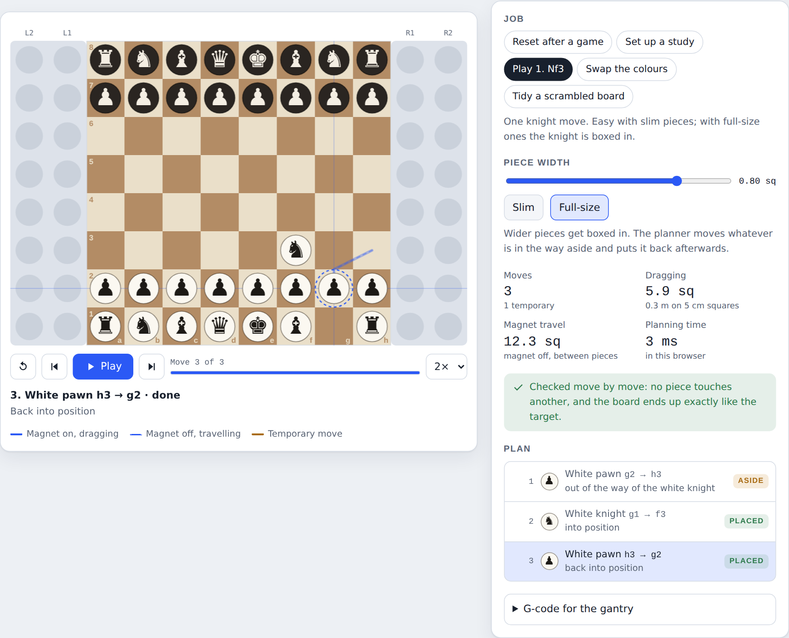
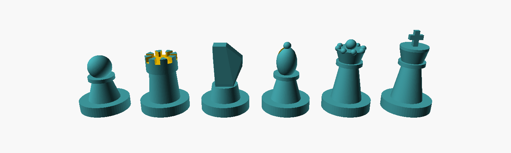

# Robotic Chessboard

A chessboard that moves its own pieces. An electromagnet on an XY gantry
slides under the board, grabs a piece through the wood, and drags it to its
square, weaving between the other pieces without touching them. It can play
the computer's moves, reset the board after a game, and set up any position.

The hard part of a board like this is the brain: deciding which piece goes
where, in what order, and along which route, so nothing collides. That part
is written and tested. This repo also holds the hardware design, CAD and
parts list for the first physical build.



## Status

| Part | State |
|---|---|
| Planning software: assignment, collision-free routing, blocker handling | ✅ Done, 20 tests |
| Independent plan checker | ✅ Done |
| G-code output for a GRBL gantry | ✅ Done |
| Animated simulator and command-line demo | ✅ Done |
| Hardware design, wiring, firmware settings | ✅ [docs/DESIGN.md](docs/DESIGN.md) |
| Parts list, about $99 | ✅ [docs/BOM.md](docs/BOM.md) |
| CAD: printable board sheet, layout drawing, parametric pieces | ✅ [cad/](cad) |
| Gantry and carriage parts in CAD | Next |
| Physical build | Next: [ROADMAP.md](ROADMAP.md) milestones 1–3 |

## What makes it different

- **It plans like a person tidying a board.** Identical pieces are
  interchangeable, so it matches each square with the nearest suitable piece,
  handles pieces that have to swap places, and routes every drag around the
  others with A* search. If a piece is boxed in, it moves the blocker aside and
  puts it back afterwards.
- **It checks its own work.** Every plan is replayed by a separate checker
  with brute-force geometry before a motor turns.
- **It was designed around a measurement, not a guess.** Simulating
  thousands of boards showed that pieces up to half a square wide never block
  each other. With 19 mm bases on 40 mm squares, every piece moves exactly
  once; full-size pieces need up to 2.5 times as many moves.
- **It explains itself.** Every move comes with a reason ("out of the way of
  the white knight") that can be shown on screen.



## Try the software

Needs Node 20 or newer; no dependencies.

```bash
node demo.js                 # list the sample jobs
node demo.js reset           # put everything back after a game
node demo.js nf3 --big       # full-size pieces: it moves a blocker and puts it back
node demo.js reset --storage 1 --square 40 --size 0.475 --gcode reset.gcode   # G-code for the v1 board
npm test
```

To watch it animated, run `npm run sim` and open
http://localhost:8000/simulator.html.

## How the planner thinks

1. **Assign.** Each target square is matched with a piece of the right type so
   the total distance is as small as possible (Hungarian algorithm, one run per
   piece type). Pieces left over go to storage.
2. **Order.** It runs whichever move has a free destination, nearest to the
   magnet first. When every destination is taken (pieces that must trade
   places), one of them steps onto a spare square first.
3. **Route.** Each drag is found with A* search on a half-square grid, and is
   only allowed if the dragged piece stays one full piece width from every
   other piece the whole way.
4. **Clear the way.** If a piece is boxed in, a second search finds the route
   that disturbs the fewest pieces. They step aside to spots they can get back
   from, then return. With full-size pieces it fills the board from the inside
   out and fills storage from the outer column in.
5. **Check.** `src/verify.js` replays the plan independently.

| Job | Slim pieces (0.45 of a square) | Full-size pieces (0.8) |
|---|---|---|
| Reset after a game | 22 moves | 26 moves (4 temporary) |
| Set up a study | 32 | 32 |
| Play 1. Nf3 | 1 | 3 (1 temporary) |
| Swap the colours | 48 (16 temporary) | 53 (20 temporary) |
| Chess960 setup, average of all 960 | 15.6 (3.6 temporary) | 38.3 (17.1 temporary) |

## Using it from code

```js
import { START_FEN, createBoard } from './src/board.js';
import { planArrangement } from './src/planner.js';
import { toGcode } from './src/gcode.js';

const board = createBoard({ storageColumns: 1 });
const now = { e4: 'P', d5: 'p', 'R1-1': 'Q' /* ...every piece, storage included */ };
const plan = planArrangement(board, now, START_FEN, { pieceDiameter: 0.475 });

for (const move of plan.moves) console.log(move.piece, move.from, move.to, move.why);
const gcode = toGcode(plan.moves, { squareMm: 40 });
```

Inputs can be a FEN string, a `Map` of cell to piece, or an object keyed by
cell name (`e4`, or `L1-3` / `R1-8` for storage slots). The target describes
the 64 play squares; anything not needed there ends up in storage. If a job is
impossible (a second queen that doesn't exist, or more captured pieces than
storage slots), you get `{ ok: false, error }` instead of a plan.

## Repo map

| Path | What it is |
|---|---|
| `src/` | Planner, routing, checker, G-code, sample jobs |
| `tests/` | `node --test` suites: sample jobs, random boards, Chess960 setups |
| `demo.js` | Command-line demo |
| `simulator.html` | Animated top-down simulator |
| `docs/DESIGN.md` | Hardware design, wiring, firmware settings, test plan |
| `docs/BOM.md` | Parts list and budget |
| `cad/board-sheet.svg` | 1:1 printable playing surface (400 × 320 mm) |
| `cad/board-layout.svg` | Same, with dimensions and the magnet's travel area |
| `cad/make-board.js` | Regenerates both drawings for any square size |
| `cad/pieces.scad` | Parametric OpenSCAD pieces with a washer pocket |
| `ROADMAP.md` | Milestones from a magnet test to online play |
| `JOURNAL.md` | Build log |

## License

MIT, see [LICENSE](LICENSE).
