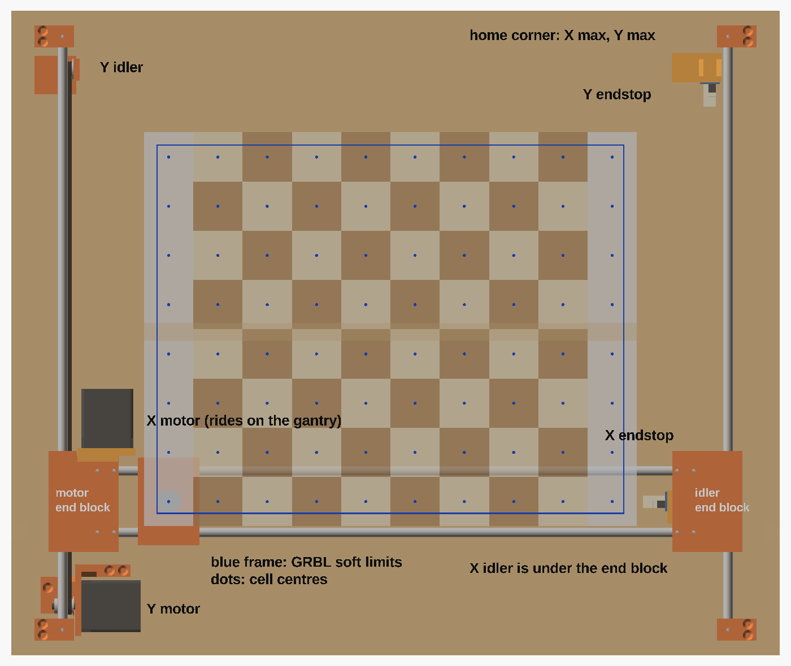

# CAD

Everything needed to print and assemble the v1 gantry, plus the board sheet
and the chess pieces. The OpenSCAD files are parametric: every shared size
lives in `params.scad`.


## Files

| File | What it is |
|---|---|
| `params.scad` | Every shared dimension: grid, rods, bearings, motor, belt, magnet, clearances, heights, layout, travel limits |
| `gantry-parts.scad` | The ten printed gantry parts, one module each. `part="name"` exports one in its print orientation; `part="all"` lays them all out |
| `assembly.scad` | The whole machine with stand-ins for the bought parts, a section view, a top view, and `echo()` checks for reach, clearances and interference |
| `export.sh` | Writes every STL to `stl/`, renders the four pictures in `docs/img/` and prints the checks. Fails if a check fails |
| `stl/` | The exported parts, ready to slice |
| `pieces.scad` | The six chess pieces with a pocket for the steel washer |
| `make-board.js` | Draws `board-sheet.svg` (print at 100% and glue on the top) and `board-layout.svg` (the same with dimensions) |
| `make-wiring.js` | Draws the wiring schematic (see its header) |

Regenerate everything with `bash cad/export.sh` (OpenSCAD 2021.01 or newer;
set `OPENSCAD=/path/to/openscad` if it is not on your PATH). On a Linux
machine with no screen, run it as `xvfb-run -a bash cad/export.sh`. It takes
about two and a half minutes, most of it the section picture.

## How it is laid out



Machine coordinates start at the front-left corner of the base's top
surface: X to the right (the board's 10 cells), Y away from you (the 8 ranks),
Z up.

- **Y axis.** Two 500 mm rods run front to back on the base at x = 30 and
  x = 570, each held by two printed holders. Each end block rides one rod on two
  LM8UU.
- **X axis.** The two X rods sit 50 mm apart in sockets in the two end
  blocks, at the same height as the Y rods (z = 42.5). Each rod end goes
  25.5 mm into its socket and is locked by two grub screws. The carriage rides
  the rods on four LM8UU.
- **Belts.** Both belts run in vertical loops right under the rods: the X belt
  under the rear X rod, the Y belt under the left end block's bearing housing,
  4.5 mm inboard of the left Y rod. Every pulley and
  idler axle is at z = 24.25, so the upper run of each belt lies flat against
  the underside of the part it pulls (z = 31) and is clamped there. The motors
  lie on their sides.
- **X motor** hangs behind the left ("motor") end block on the X motor mount;
  its pulley sits in a pocket under the end block. A lip along the top of the
  mount rests on the end block, so belt tension can't turn it. The **X idler**
  sits in a slot under the right ("idler") end block.
- **Y motor** is at the front left, **Y idler** at the back left on a mount
  that slides back up to 6 mm to tension the belt. The Y belt pulls the left
  end block, the side that carries the heavy X motor.
- **Switches** are at the back right (X max, Y max), because GRBL homes toward
  + unless `$23` says otherwise. The carriage presses the X switch, which sits
  on a bracket on the idler end block; the idler end block presses the Y
  switch, which sits on a post on the base. Both boards stand on end with the
  switch at the top and the connector at the bottom, below the part that
  presses the lever, so the plug can't stop the switch tripping however tall
  it is.
- **Top.** A frame of four 12 mm plywood walls screwed to the outside edges of
  the base carries the 3 mm top. Nothing touches the top from below except the
  magnet.


The magnet floats in a sleeve in the carriage. A light spring under it pushes
its face (with PTFE tape on it) up against the underside of the top. An M3
screw comes up through the carriage floor and threads into the magnet's back:
it keeps the magnet upright, and its head stops the magnet 5 mm above the top's
underside when the top is off.

## Printed parts


PLA, 0.2 mm layers, 4 perimeters, 30% infill. No supports: horizontal holes
have a 45-degree roof and each part is turned so the only overhangs left are
bridges. The longest is the 9.5 mm roof of the solder-pin pocket in the X
endstop bracket; the rest are 6 mm or less (checked on the STLs). All parts
fit a 220 x 220 mm bed with lots of room.

| Part | Qty | How it sits on the bed | Size on the bed (mm) | Plastic, time (each) |
|---|---|---|---|---|
| `y-rod-holder` | 4 | Standing up, flange down | 32 x 18 x 51 | 12 g, 20 min |
| `end-block-motor` | 1 | Upside down (top face on the bed) | 57 x 82 x 23 | 55 g, 1.5 h |
| `end-block-idler` | 1 | Upside down, idler slot facing up | 57 x 82 x 36 | 58 g, 1.6 h |
| `x-motor-mount` | 1 | Flat, back face down, lip up | 47 x 52 x 11 | 11 g, 19 min |
| `carriage` | 1 | Upright, sleeve up | 50 x 71 x 25 | 41 g, 1.2 h |
| `y-motor-mount` | 1 | Upright, feet down | 73 x 58 x 47 | 16 g, 26 min |
| `y-idler-mount` | 1 | Upright, base down | 36 x 31 x 30 | 9 g, 15 min |
| `belt-clamp` | 4 | Flat, ridges up | 16 x 22 x 5 | 2 g, 3 min |
| `x-endstop-mount` | 1 | Flat, PCB side down | 40 x 27 x 12 | 6 g, 10 min |
| `y-endstop-mount` | 1 | Upright, foot down | 40 x 24 x 55 | 10 g, 17 min |
| **Total** | 16 | | | **about 260 g, 7.3 h** |

Plastic and time are rough estimates from the STL volumes, not from a slicer:
shell = surface area x 1.2 mm, plus 30% of the rest, at 1.24 g/cm³, laid down
at about 8 mm³/s. Your slicer will give better numbers. The chess pieces come
on top of this.

## Hardware

Bought parts from [docs/BOM.md](../docs/BOM.md) that the CAD uses: four 8 x 500
mm rods (uncut), eight of the ten LM8UU (four in the end blocks, four in the
carriage), two NEMA 17 motors, two 20T pulleys, two of the four 20T idlers,
the P20/15 magnet, two mechanical endstop modules and the PTFE tape for the
magnet face. Belt: about 1.0 m for X
and 0.95 m for Y, out of the 5 m roll.

The X motor must be no longer than 51 mm (the CAD draws a 48 mm body). A
longer one, such as a 60 mm high-torque NEMA 17, hits the back wall before
the Y switch stops the gantry.

The endstop parts are drawn for a 40 x 16 mm board with the switch at one end,
the 3-pin connector at the other, and two holes 35 mm apart, 2.5 mm in from
one long edge. One shop lists the v1.2 board as 36.5 x 16 x 10 mm overall. If
your board's holes are elsewhere, drill new 2.9 mm pilot holes in the bracket
and the post; keep the switch at the top.

Not in the BOM, needed for the build:

| Item | Qty | Where |
|---|---|---|
| M3 x 6 grub screws (set screws) | 12 | Lock the rods: 4 in the holders, 8 in the end blocks (two per X rod end; headless, so nothing sticks up toward the top) |
| M3 x 10 socket screws | 8 | Belt clamps: 4 under the carriage, 4 under the motor end block. Not longer: the pilot holes are 5 mm deep |
| M3 x 10 countersunk (flat head) | 9 | Both motors to their mounts, flush; 1 for the X endstop bracket |
| M3 x 16 socket screws | 2 | X motor mount to the motor end block |
| M3 x 12 socket screws | 2 | X endstop PCB to its bracket |
| M3 x 6 socket screws | 2 | Y endstop PCB to its post |
| M3 x 25 socket screws | 2 | Magnet guide screw; X idler axle |
| M3 x 18 socket screw | 1 | Y idler axle |
| M3 nuts, M3 washers | 2, 4 | Idler axles (a washer each side of each idler) |
| Wood screws, 3.5-4 mm, about 16 mm long | 19 | 8 for the holders, 3 Y motor mount, 2 Y idler mount and 2 Y endstop post (pan head + washer, in slots), 4 for the top's corners; more for the walls |
| Compression spring | 1 | About 20 mm long, 5-7 mm across, fits over an M3 screw (inside 3.5 mm or more), light: 0.1-0.3 N/mm |
| 12 mm plywood or MDF strips | 2 + 2 | Walls: 624 and 500 mm long, 61 mm plus your base's thickness tall (73 mm for a base of exactly 12 mm) |
| 3 mm hardboard, smooth on both sides (S2S), or 3 mm MDF | 1 | Top, 624 x 524 mm |

The M3 screws in the printed parts cut their own thread in 2.9 mm pilot holes.

## Assembly

1. **Check the fits.** A rod should slide through the 8.2 mm holes. Press the
   LM8UU into their bores with a vise, two per bore, one from each end until
   they stop against the shoulder in the middle. The magnet should slide
   freely in the sleeve; sand the sleeve if it doesn't. Cut a thread in every
   grub-screw hole by running an M3 socket screw (or an M3 tap) in and out:
   a grub screw on a 1.5 mm hex key can't cut its own thread in PLA.
2. **Carriage.** Put the spring in the pocket on the floor. Push the M3 x 25
   guide screw up through the floor and the spring and screw it into the back
   of the magnet until it bottoms out, then half a turn back. Lead the magnet's
   wires out through the slot. Put two layers of PTFE tape on the magnet face.
   The belt clamp screws come later; their holes pass about 1 mm from the
   bearing bores, so press the bearings in first and don't overtighten them.
3. **Motors.** Fit each pulley before the motor goes on its mount (the pulley
   passes through the 22.6 mm hole):
   - X motor: hub toward the motor, the pulley's end 7 mm from the motor face.
   - Y motor: hub away from the motor, the pulley's end 6 mm from the face.
   Bolt each motor to its mount with four countersunk M3 x 10. Turn the X
   motor so its connector points up or toward the carriage: it runs 3.1 mm
   above the base, and toward the left its plug would hit the Y idler mount.
4. **Gantry.** Slide the carriage onto both X rods. Push the rod ends into the
   two end blocks as far as they go (25.5 mm) and lock each with its two grub
   screws, which end up 1.5 mm below the top of the block. Hang the X motor
   mount on the back of the motor end block with its lip on top of the block,
   and fix it with two M3 x 16 from behind, above the motor. Put the X idler
   with a washer each side in the slot under the idler end block, on an M3 x 25
   with a nut.
5. **Y rods.** Stand the gantry on the base. Slide each Y rod in from outside
   through a holder, through the end block's bearings and into the far holder,
   flush with both outer faces, and lock it with the grub screws. Holders go at
   the corners of the base with their flanges outboard (turn the part 180
   degrees for the right side). Screw them down while the gantry slides freely
   end to end; the rods must be 540 mm apart at both ends.
6. **Y drive.** Screw the Y motor mount down at the front left (plate face at
   x = 40, front edge at y = 4); all three of its screws are clear of the Y
   rod. Put the Y idler mount at the back left as far forward as it goes, with
   its axle at x = 34.5, y = 464 and each wood screw at the back end of its
   slot, so the mount can slide back. Clamp one end of the Y belt under the
   motor end block, take it forward round the Y pulley, back along the bottom,
   round the idler and forward to the second clamp. Pull the belt tight
   through that clamp with pliers and tighten it. Then slide the idler mount
   back (up to 6 mm) to finish tensioning and tighten its screws. Push the
   gantry all the way back by hand: the X motor passes 1.4 mm from the idler
   mount's inner cheek, so check it clears.
7. **X drive.** Same idea: one end under the carriage's left clamp, left round
   the X pulley, along the bottom to the X idler, back to the right clamp.
   Pull the end tight through the right clamp with pliers and tighten it.
   There is no screw tensioner on X: to re-tension later, loosen the right
   clamp from below with a short hex key, pull, and tighten again.
8. **Switches.** Both boards go switch up, connector down.
   - X: screw the bracket to the inner face of the idler end block with the
     countersunk M3 x 10, its block tucked under the end block. Fit the PCB
     with two M3 x 12: the top one goes on through the bracket into the end
     block, the bottom one into the bracket's block.
   - Y: fix the PCB to the post with two M3 x 6. Screw the post down at the
     back right (PCB at x = 547 to 563) and slide it so the switch clicks when
     the X motor is about 5.5 mm from the back wall.
   - Lead each switch cable straight down from its plug to the base, away from
     the carriage, the X belt and the X idler.
9. **Frame and top.** Measure the base's thickness and cut the walls so their
   tops stand 61 mm above the base's top face. Screw them to the outside edges
   of the base. Lay the top on, smooth side down where the magnet slides (with
   one-side-smooth hardboard the sheet will show the texture of the other
   side), and screw or pin it to the walls at the four corners, so it always
   goes back in the same place. Glue the board sheet with its front-left corner
   108 mm from the top's left edge and 105 mm from its front edge, within
   ±5 mm. That centres it in the area GRBL's soft limits allow; the
   calibration in DESIGN.md finds the exact offset.

## Key clearances

| What | Value |
|---|---|
| Rod holes (holders, end blocks) | 8.2 mm, locked with M3 grub screws; X rods 25.5 mm deep in each end block, two grub screws each |
| LM8UU bores | 15.2 mm press fit, 9.5 mm shoulder between the two bearings |
| M3 clearance / self-tapping pilot | 3.4 mm / 2.9 mm |
| Belt clamp pilots | 5 mm deep (an M3 x 10 goes in 4.6 mm); about 1 mm of plastic to the bearing bores in the carriage and to the shoulder bore in the motor end block |
| NEMA 17 | 31 mm M3 square, 22.6 mm hole for the 22 mm boss |
| Belts | Pulley and idler axles all at z = 24.25; upper runs at z = 30.4-31.0 on the flat undersides; return runs at z = 17.5-18.9, 3.7 mm below the clamp screw heads |
| Magnet in the sleeve | 20.6 mm bore for the 20 mm magnet |
| Spring | 13 mm long at work, 10 mm if the top sags 3 mm, 18 mm at the up-stop |
| Top | Underside at z = 61. Highest moving parts (sleeve rim, X motor mount lip) at z = 56: 5 mm clear, 2 mm with 3 mm of sag |
| Magnet reach | With `$130=380` and `$131=300` the soft limits allow x 105.9-485.9 and y 103-403. The cell centres are at x 115.9-475.9 and y 113-393: 10 mm to spare on every side (11.5 mm or more to the hard stops) |
| Travel for GRBL | Up to `$130=384` and `$131=309` fit before the far end of travel; DESIGN.md's 380 and 300 stop 4.4 mm (X) and 9 mm (Y) short of it |
| Ends of travel | Parts stop 1 mm apart (end block / Y motor mount, carriage / motor end block); on the home side the switches trip 1.5 mm before the switch body is reached, and the next part is 5.5 mm (Y) or 8 mm (X) away |
| Endstop plugs | Below the face that presses the lever, so any plug height clears; the checks assume a connector and plug up to 18 mm tall |
| Y idler mount | Slides back up to 6 mm; then 1 mm from the back-left holder |
| X motor | 3.1 mm above the base; 1.4 mm from the Y idler mount's inner cheek; at the Y switch's hard stop its back is 4 mm from the back wall (48 mm body) |
| Footprint and height | 624 x 524 mm; 76 mm to the playing surface (with a 12 mm base), 107.5 mm to the top of a king |

## Checks

`assembly.scad` prints these every time it runs (and `export.sh` stops if any
says FAIL):

- the magnet reaches every cell centre with at least 5 mm to spare inside
  GRBL's soft limits (`$130=380`, `$131=300`);
- those soft limits stop short of the hard stops at the far end of travel;
- nothing but the magnet comes within 1 mm of a top that sags 3 mm;
- the spring is never slack or crushed, and the magnet stays in its sleeve;
- the moving parts stay inside the base, so the walls are outside their path;
- each pulley's teeth line up with its belt, and the belts' return runs pass
  under the clamp screws. That the axles all sit at one height and the upper
  runs lie on the flat undersides holds by construction, so it isn't tested;
- at each switch's trip point, measured on the parts' bounding boxes: the
  switch body is still 1.5 mm away, and every other part (the endstop
  connectors and plugs included) is further away than that;
- a bounding-box test finds no overlap between moving and fixed parts at the
  four corners of travel;
- fixed parts that sit close to each other (motor mount and holders, the idler
  mount slid fully back, the Y endstop post) stay at least 1 mm apart.

The exact interference test renders only the overlaps, at the four corners:

```bash
openscad -D 'check="collide"' -o /tmp/collide.stl cad/assembly.scad
```

OpenSCAD should answer "Current top level object is empty". To see that the
test can fail, push the gantry 6 mm past its front stop with
`-D check_push=6`: it then reports a solid. Each run takes about three
minutes.

Cables are not modelled, so none of these checks cover them.

## Notes for the firmware and software

- Stock GRBL 1.1 homes Z first and stops with `ALARM:9` on a board with no Z
  switch. Flash it with `HOMING_CYCLE_0` set to X and Y together, as
  [CALCULATIONS.md section 12](../docs/CALCULATIONS.md) describes.
- There are no switches at X min and Y min. If a motor runs the wrong way,
  `$H` drives the carriage or the gantry into the hard stop at the far end and
  keeps going for up to 1.5 x `$130`. Before the first `$H`, jog in small steps
  (`$J=G91 X5 F500`, then `$J=G91 Y5 F500`) and check that +X moves the
  carriage right, toward the idler end block, and +Y moves the gantry back.
  If not, invert that axis with `$3`.
- With the switches at X max / Y max, GRBL's default `$23=0` is right. After
  homing, machine zero is where each switch trips and GRBL counts positions
  downward from there (`limits.c` and `system.c` in GRBL 1.1), so machine
  coordinates on this board run from -`$130` to 0 and the `offsetX` /
  `offsetY` found by jogging to a1 and h8 will be negative too (or set a work
  offset).
- GRBL has one limit input per axis. On the CNC Shield V3 the X- and X+ header
  pins are wired in parallel to that one input (according to builders' forum
  reports, not the maker's documentation), so the switch can plug into X- even
  though it sits at X max.

## Not checked yet

- The spring is not in the BOM, and its rate is a guess. Too stiff and the
  magnet drags on the top; too weak and it may not follow the top's sag.
- The magnet's thread depth, and where its wires leave it, were not measured.
  The slot in the sleeve leaves room either way.
- The endstop board: hole positions follow one datasheet, and the switch
  heights and the connector-and-plug size (18 mm tall) are estimates. A switch
  that trips at a different height only moves machine zero by the difference,
  which the 10 mm margins and the calibration absorb; the Y post can also
  slide to put it back.
- Pulley hub and tooth lengths are typical values, not measured.
- How much the 600 x 500 mm span of 3 mm hardboard sags is an assumption (3 mm
  allowed). So is the advice about smooth sides: it comes from general
  knowledge of hardboard, not from a sheet measured here.
- The base must be flat to about 1 mm (check with a straightedge; MDF is
  safer than plywood), and nothing may lie on it in the strip the X motor
  sweeps (x 40-90, from y 130 to the back): the motor runs 3.1 mm above it.
- The gantry parts take about 260 g of PLA on top of the pieces, more than the
  BOM's 250 g for everything.
- The electronics are not modelled. Free space under the top: a strip along
  the front (x 95-520, y 0-52) and along the back (x 95-515, y 446-500), both
  61 mm high. Cable routing for the magnet, X motor and switches is not
  modelled either; leave slack loops so nothing reaches the belts.
- The X belt has no screw tensioner; it is tensioned by hand at the carriage
  clamp. GT2 belt stretch over time was not looked up.
- Racking: the Y belt pulls only the left end block (the one with the X
  motor). The right end block is dragged through the X rods, which sit
  25.5 mm deep in both blocks with two grub screws each, and each block runs
  on two LM8UU 79 mm apart end to end. If the rod joints stay rigid, the two
  rods resist racking at about 10.7 N/mm (beam theory, 2 x 12EI/L³ over the
  449 mm between the end blocks; not measured); if a grub screw loosens as the
  PLA creeps, the joint can turn and the right end lags. Whether the gantry stays square is something
  Milestone 2's pen test has to show (draw the right-hand storage column).
- Heat: the magnet sits in a PLA sleeve. PLA softens around 55-60 °C. The
  magnet is only on while dragging, but if it gets too warm to touch during a
  long job, print the carriage in PETG.
