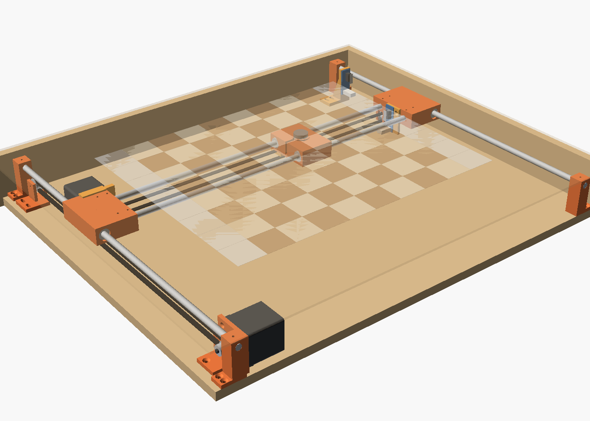
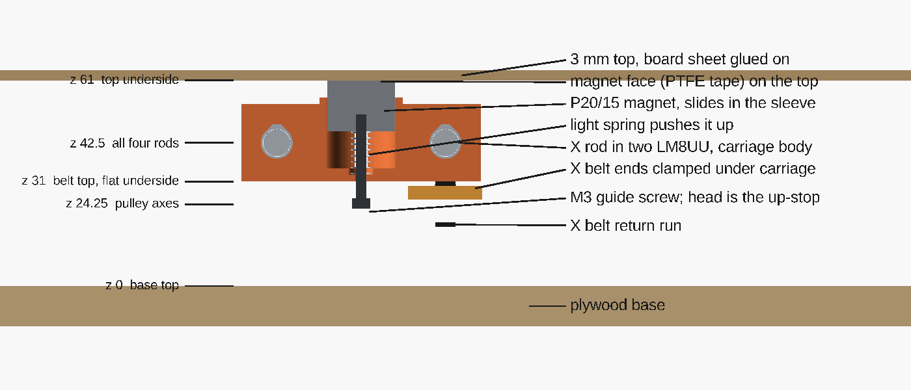
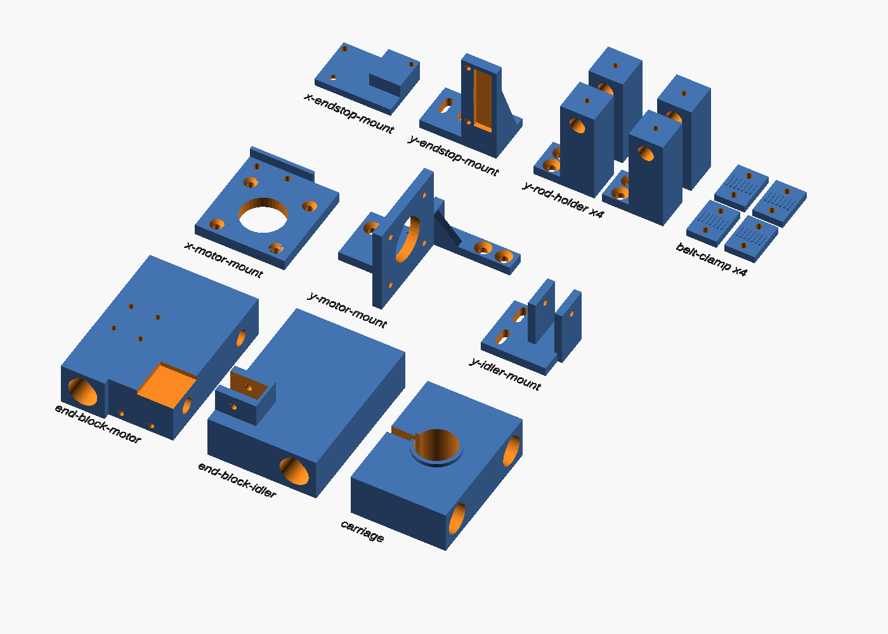
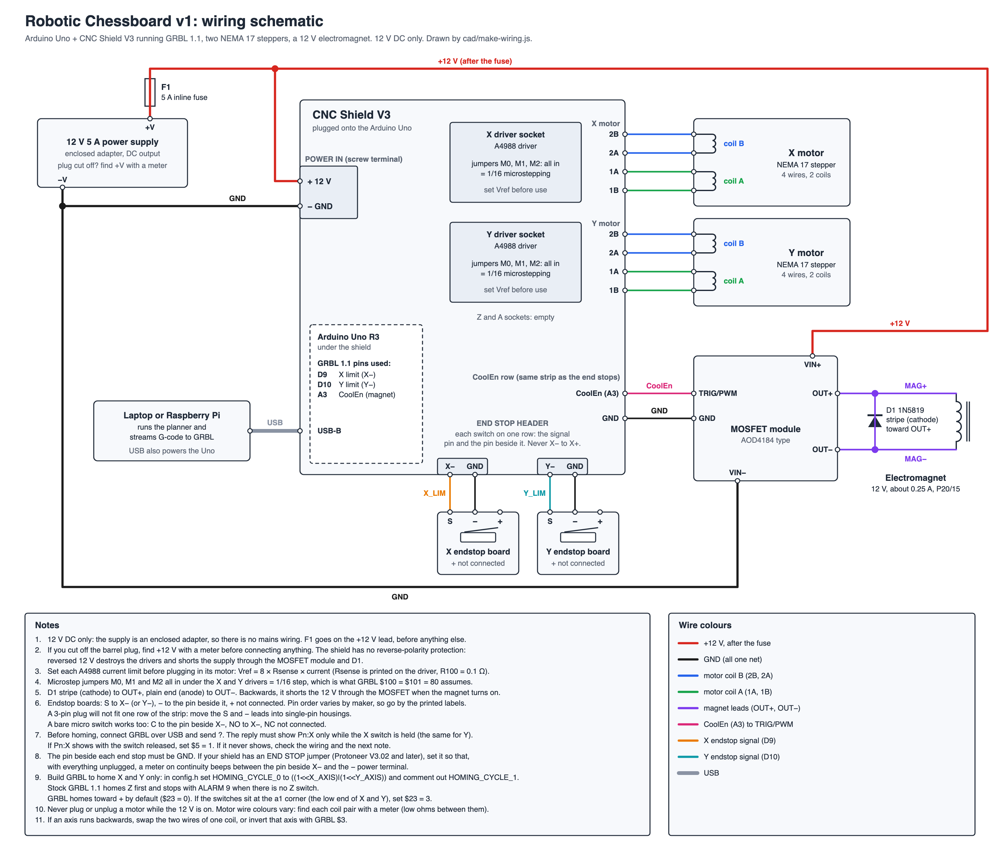

# Design: compact robotic chessboard (v1)

A chessboard that moves its own pieces. An electromagnet on an XY gantry
slides under the board top, switches on under a piece, drags it along a
route that avoids every other piece, and switches off. The route planning is
done by the software in this repo and sent to the gantry as G-code.


## Specs

| | |
|---|---|
| Square size | 40 mm |
| Grid | 10 × 8 cells: the 8 × 8 board plus one storage column on each side (16 slots for captured pieces) |
| Board surface | 400 × 320 mm, printed sheet on 3 mm hardboard ([cad/board-sheet.svg](../cad/board-sheet.svg)) |
| Magnet travel | 360 × 280 mm between the outermost cell centers ([cad/board-layout.svg](../cad/board-layout.svg)) |
| Machine size | 624 × 524 mm, 76 mm tall to the playing surface ([cad/assembly.scad](../cad/assembly.scad)) |
| Pieces | 3D-printed, 19 mm bases (0.475 of a square), 21–32 mm tall, M8 washer in each base ([cad/pieces.scad](../cad/pieces.scad)) |
| Magnet | 12 V holding electromagnet, 20 mm, switched by a MOSFET from GRBL's `M8`/`M9` |
| Motion | Two NEMA 17 steppers, GT2 belts, 8 mm rods with LM8UU bearings |
| Controller | Arduino Uno + CNC Shield V3 running GRBL 1.1 |
| Brain | This repo's planner, on a laptop or Raspberry Pi, over USB |
| Power | 12 V 5 A supply, 5 A fuse |
| Parts | [BOM.md](BOM.md) |
| Numbers behind the design | [CALCULATIONS.md](CALCULATIONS.md) |

Why 19 mm bases: the planner models each piece as a disc. Pieces up to half a
square wide always fit along the lines between other pieces, so every piece
moves exactly once. Wider pieces get boxed in and need extra moves (the README
has the numbers).


## Mechanical



The whole machine is modelled in OpenSCAD in [cad/](../cad): every shared
size in [params.scad](../cad/params.scad), the printed parts in
[gantry-parts.scad](../cad/gantry-parts.scad), and the full assembly with its
fit checks in [assembly.scad](../cad/assembly.scad).
[cad/README.md](../cad/README.md) has the parts table, the extra screws,
assembly steps and the key clearances. `bash cad/export.sh` rebuilds the STLs
and pictures and stops if any check fails.



- **Frame:** two Y rods on the base along the left and right edges, held by
  four printed holders. The X gantry is two end blocks joined by the two X
  rods; each end block rides its Y rod on two LM8UU bearings. The magnet
  carriage rides the X rods on four more.
- **Drive:** one stepper per axis with a GT2 belt loop. The Y motor sits at
  the front left and pulls the left end block. The X motor rides on that end
  block, so it must be no longer than 51 mm. The X idler sits inside the
  other end block. If the gantry racks because only one side is driven,
  move the Y belt toward the middle of the gantry.
- **Constant gap:** the magnet slides in a sleeve in the carriage on an M3
  guide screw, and a light spring pushes it up against the underside of the
  top. Its face is covered in PTFE tape. Magnetic pull falls off quickly with
  distance, so this keeps the grip the same across the whole board, even
  where the top sags.
- **Board top:** a 3 mm sheet on walls around the edge of the base, 5 mm
  above the highest moving part. Nothing supports it from below inside the
  travel area.
- **Homing:** the two endstops sit at the back-right corner (X max, Y max).
  The carriage presses the X switch and the idler (right) end block presses
  the Y switch.
- **Printed parts:** 16 parts, about 260 g of PLA and 7 hours of printing, all
  support-free on a 220 × 220 mm bed: 4 Y rod holders, the motor and idler end
  blocks, the X motor mount, the magnet carriage, the Y motor and Y idler
  mounts, 4 belt clamps, and the X and Y endstop mounts. The STLs are in
  [cad/stl/](../cad/stl).



## Electrical

[](img/wiring.svg)

Click the picture for the full-size SVG. It is drawn by
[cad/make-wiring.js](../cad/make-wiring.js), and its notes cover current
limits, microstep jumpers, diode orientation and the endstop check.

| From | To | Notes |
|---|---|---|
| Supply +12 V | Fuse, then the shield's power terminal and the MOSFET module's VIN+ | 12 V only, no mains wiring. If you cut off the plug, find +12 V with a meter first: the shield has no reverse-polarity protection |
| Supply −V | Shield GND and the MOSFET module's VIN− | One shared ground |
| Shield X / Y driver sockets | X and Y steppers | Set each A4988's current limit (Vref) before plugging in its motor; all three microstep jumpers in for 1/16 |
| Shield `X-` and `Y-` endstop pins | Endstop boards | S to `X-` (`Y-`), − to the pin beside it, + not connected. Before homing, send `?` and check `Pn:X` shows only while the switch is held |
| Shield `CoolEn` (Arduino A3) and GND | MOSFET module TRIG/PWM and GND | GRBL `M8` turns the magnet on, `M9` off |
| MOSFET module OUT+ / OUT− | Electromagnet | 1N5819 across the magnet terminals, stripe (cathode) to OUT+ |
| Arduino USB | Laptop or Raspberry Pi | Powers the Arduino and carries the G-code |

Power: at most 3.22 A from the 5 A supply, a worst-case bound with both
motors' coils at the full set current and the magnet on
([CALCULATIONS.md §11](CALCULATIONS.md#11-power-budget-and-magnet-heat)).

## Firmware settings (GRBL 1.1)

**Flash GRBL with a two-axis homing cycle.** Stock GRBL 1.1 homes Z first,
and this board has no Z switch, so `$H` fails with `ALARM:9`. Before
compiling and uploading GRBL, edit `grbl/config.h`:

```c
#define HOMING_CYCLE_0 ((1<<X_AXIS)|(1<<Y_AXIS))  // home X and Y together
// #define HOMING_CYCLE_1 ((1<<X_AXIS)|(1<<Y_AXIS))
```

Then set these, from [CALCULATIONS.md §12](CALCULATIONS.md#12-recommended-grbl-settings):

| Setting | Value | Meaning |
|---|---|---|
| `$5` | 0 | Limit pins read as triggered when pulled low: suits switches to GND (GRBL's default) |
| `$100`, `$101` | 80 | Steps per mm: GT2 belt, 20-tooth pulley, 1/16 microstepping |
| `$110`, `$111` | 6000 | Maximum speed, mm/min |
| `$120`, `$121` | 400 | Acceleration, mm/s²: 28× below where the king tips, about 3× torque margin |
| `$11` | 0.010 | Junction deviation (GRBL's default) |
| `$20` | 1 | Soft limits after homing |
| `$22` | 1 | Homing on |
| `$23` | 0 | Home toward +X and +Y: the switches are at X max and Y max (GRBL's default) |
| `$25` | 1500 | Homing seek speed, mm/min: homing takes up to 18.7 s, against about 49 s at the default 500 |
| `$130`, `$131` | 380, 300 | Travel limits, mm (the CAD has room for up to 384 and 309) |

Keep the defaults for `$24`, `$26` and `$27`: the slow second approach is what
makes the homed position repeat. After homing, machine coordinates run from
−`$130` to 0 and −`$131` to 0, so the board's offsets come out negative.
Before the first `$H`, jog in small steps and check that +X moves the carriage
toward the idler end block and +Y moves the gantry back; if not, invert that
axis with `$3` ([cad/README.md](../cad/README.md)).

## Software

1. The planner (`src/planner.js`) takes the current arrangement, storage
   included, and a target position, and returns the moves with routes and
   reasons.
2. `src/verify.js` replays the plan and rejects it if any piece would touch
   another.
3. `calibrate.js` fits the board to the machine. Jog the magnet to the
   centers of a1 and h8 (and h1 and a8 for a better fit), then run
   `node calibrate.js --a1 X,Y --h8 X,Y --storage 1 --square 40`. It works out
   the board's offset, the real square size on each axis and any small
   rotation, and writes `calibration.json`. It refuses measurements that look
   like a jog to the wrong square (`--force` overrides).
4. `src/gcode.js` turns the moves into G-code for this board:
   `toGcode(moves, { calibration })`, or `{ squareMm: 40, offsetX, offsetY }`
   without a calibration.
5. `send.js` streams the G-code to GRBL over USB. It waits for each `ok`, and
   leaves the magnet off whenever it stops: after an `error` (it sends `M9`),
   an `ALARM` (GRBL resets itself) or Ctrl-C (feed hold, then reset). It needs
   the optional `serialport` package (`npm install`).

For this board:

```bash
node demo.js reset --storage 1 --size 0.475 --calibration calibration.json --gcode reset.gcode
node send.js reset.gcode --port /dev/ttyUSB0 --home
```

`node send.js reset.gcode --dry-run` prints what would be sent without a
machine attached.

## How it will be tested

These are the "done when" checks from [ROADMAP.md](../ROADMAP.md):

1. **Magnet:** a king follows the magnet 20 cm through the board top ten times
   in a row and stays put when it's off. [CALCULATIONS.md](CALCULATIONS.md#what-milestone-1-should-measure)
   lists what to measure along the way.
2. **Gantry:** after homing, a pen on the carriage hits all 80 cell centers
   within ±1 mm, three runs in a row.
3. **Moves:** the 22-move reset job runs three times with every piece centered
   on its square.
4. **Game:** a full game against Stockfish, then a reset.

## Open questions

- **Grip.** Can the 20 mm magnet drag a king through 3 mm of hardboard plus
  paper? The two estimates in [CALCULATIONS.md](CALCULATIONS.md) straddle the
  pull needed, so this is the biggest risk, and Milestone 1 answers it before
  anything else is built.
- **Pieces the magnet passes.** Drags pass standing pieces 20 mm away with
  the magnet on. The magnet's sideways pull there has to fall to under a
  quarter of its peak, or it drags them along too. Milestone 1 measures it,
  and any fix for weak grip has to be checked against it.
- **Tipping.** On paper the king tips only above about 11300 mm/s², 28× the
  acceleration used; Milestone 3 confirms it.
- **Racking.** Is one Y motor enough, or does the gantry rack? Test it in
  Milestone 2.
- **Bought-part sizes.** The endstop board's hole positions, the felt's
  thickness and the washers' outer diameter aren't stated in their listings;
  measure them before printing the mounts and pieces.
