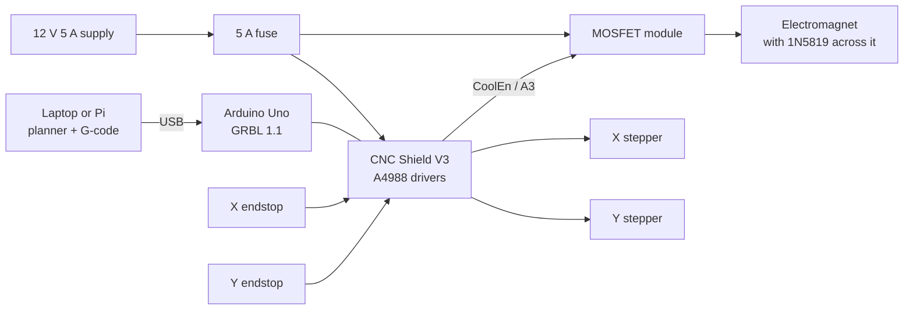

# Design: compact robotic chessboard (v1)

A chessboard that moves its own pieces. An electromagnet on an XY gantry
slides under the board top, switches on under a piece, drags it along a
route that avoids every other piece, and switches off. The route planning is
done by the software in this repo and sent to the gantry as G-code.


## Specs

| | |
|---|---|
| Square size | 40 mm |
| Grid | 10 × 8 cells: the 8 × 8 board plus one storage column on each side (16 slots for captured pieces) |
| Board surface | 400 × 320 mm, printed sheet on 3 mm hardboard ([cad/board-sheet.svg](../cad/board-sheet.svg)) |
| Magnet travel | 360 × 280 mm between the outermost cell centers ([cad/board-layout.svg](../cad/board-layout.svg)) |
| Pieces | 3D-printed, 19 mm bases (0.475 of a square), 21–32 mm tall, M8 washer in each base ([cad/pieces.scad](../cad/pieces.scad)) |
| Magnet | 12 V holding electromagnet, 20 mm, switched by a MOSFET from GRBL's `M8`/`M9` |
| Motion | Two NEMA 17 steppers, GT2 belts, 8 mm rods with LM8UU bearings |
| Controller | Arduino Uno + CNC Shield V3 running GRBL 1.1 |
| Brain | This repo's planner, on a laptop or Raspberry Pi, over USB |
| Power | 12 V 5 A supply, 5 A fuse |

Why 19 mm bases: the planner models each piece as a disc. Pieces up to half a
square wide always fit along the lines between other pieces, so every piece
moves exactly once. Wider pieces get boxed in and need extra moves (the README
has the numbers).


## Mechanical

```
   pieces: printed body, M8 washer glued in the base, felt pad underneath
  ══════════════════════════════════════════════  board sheet on 3 mm top
     ▲ PTFE tape on the magnet face slides against the underside
   ┌─┴─┐
   │ E │  electromagnet on a light spring, so it stays pressed
   └─┬─┘  against the top even if the top sags a little
  ───┴───────────────────────────────────  magnet carriage on two X rods
  ═══════════════════════════════════════  X gantry, rides on two Y rods
  ▔▔▔▔▔▔▔▔▔▔▔▔▔▔▔▔▔▔▔▔▔▔▔▔▔▔▔▔▔▔▔▔▔▔▔▔▔▔▔  plywood base
```

- **Frame:** two Y rods fixed to the base along the left and right edges. The
  X gantry rides on them with two LM8UU bearings per side, spaced wide apart
  to stop it twisting. The magnet carriage rides on two X rods across the
  gantry.
- **Drive:** one stepper per axis with a GT2 belt loop. The Y motor pulls one
  side of the gantry. If that side leads and the gantry racks, move the Y belt
  to the middle of the gantry.
- **Constant gap:** the magnet is spring-loaded and slides against the
  underside of the top on PTFE tape. Magnetic pull falls off quickly with
  distance, so this keeps the grip the same across the whole board.
- **Board top:** held on a perimeter frame above the gantry. Nothing may
  support it from below inside the travel area.
- **Printed parts to design in CAD:** 8 rod holders, 2 gantry end blocks,
  1 magnet carriage with the spring pocket, 2 motor mounts, 2 idler mounts,
  2 endstop mounts.

## Electrical



| From | To | Notes |
|---|---|---|
| Supply +12 V | Fuse, then the shield's power terminal and the MOSFET module's input | 12 V only, no mains wiring |
| Shield X / Y driver sockets | X and Y steppers | Set each driver's current limit (Vref) to about 70% of the motor rating |
| Shield `X-` and `Y-` endstop pins | Endstop switches | Switches wired between signal and ground (normally open) |
| Shield `CoolEn` (Arduino A3) | MOSFET module signal input | GRBL `M8` turns it on, `M9` off |
| Shield GND | MOSFET module GND | Shared ground |
| MOSFET module output | Electromagnet | 1N5819 across the magnet terminals, stripe to +12 V |
| Arduino USB | Laptop or Raspberry Pi | Powers the Arduino and carries the G-code |

Power: each stepper draws up to about 1 A through its driver and the magnet
about 0.25 A (3 W), so a 5 A supply has plenty of headroom.

## Firmware settings (GRBL 1.1)

| Setting | Value | Meaning |
|---|---|---|
| `$100`, `$101` | 80 | Steps per mm: GT2 belt, 20-tooth pulley, 1/16 microstepping |
| `$110`, `$111` | 6000 | Maximum speed, mm/min |
| `$120`, `$121` | 400 | Acceleration, mm/s² (lower it if tall pieces wobble) |
| `$22` | 1 | Homing on |
| `$130`, `$131` | 380, 300 | Travel limits, mm |
| `$20` | 1 | Soft limits after homing |

## Software

1. The planner (`src/planner.js`) takes the current arrangement, storage
   included, and a target position, and returns the moves with routes and
   reasons.
2. `src/verify.js` replays the plan and rejects it if any piece would touch
   another.
3. `src/gcode.js` turns the moves into G-code for this board:
   `toGcode(moves, { squareMm: 40, offsetX, offsetY })`, where the offsets
   come from jogging the magnet to a1 and h8 after homing.
4. A G-code sender streams it to GRBL. To begin with, that's a free sender
   (Universal Gcode Sender, CNCjs or LaserGRBL); `send.js` comes next in the
   roadmap.

For this board: `node demo.js reset --storage 1 --square 40 --size 0.475 --gcode reset.gcode`.

## How it will be tested

These are the "done when" checks from [ROADMAP.md](../ROADMAP.md):

1. **Magnet:** a king follows the magnet 20 cm through the board top ten times
   in a row and stays put when it's off.
2. **Gantry:** after homing, a pen on the carriage hits all 80 cell centers
   within ±1 mm, three runs in a row.
3. **Moves:** the 22-move reset job runs three times with every piece centered
   on its square.
4. **Game:** a full game against Stockfish, then a reset.

## Open questions

- Is 3 mm hardboard plus paper thin enough for the 20 mm magnet to drag a
  king? Milestone 1 answers this before anything else is built.
- Do the 32 mm kings tip over at 400 mm/s² acceleration? If so, lower the
  acceleration or make the bases heavier.
- Is one Y motor enough, or does the gantry rack? Test it in Milestone 2.
